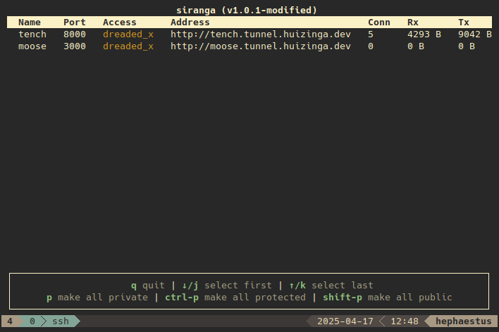

# Siranga

Siranga allows users to quickly create new subdomains that tunnel to local ports on their machine over SSH.



## Features

- Works over SSH, no need to install any other tools to forwards ports
- Using ForwardAuth tunnels can be
  - Private, only accessible by you
  - Protected, accessible by all logged in users
  - Public, accessible for everyone
- SSH keys are pulled from LDAP, so no separate upload is required.
- Provides a user interface for
  - Managing access
  - Renaming of tunnels
  - Network statistics

Siranga does NOT provide HTTPS support, it expects to run behind a reverse proxy.

## Installation

Siranga is intended to be deployed using Kubernetes, example manifest files are provided in [manifests](./manifests).
This deployment runs in a cluster with [Authelia](https://github.com/authelia/authelia), [LLDAP](https://github.com/lldap/lldap), and [Traefik](https://github.com/traefik/traefik).

## User guide

A tunnel can be opened using the following command:

```
ssh <username>@<host> [-p <ssh port>] -t -R <local port>:localhost:<local port>
```

This will open a new tunnel with a randomly generated name, you can specify a name for the tunnel by instead using `-R <name>:<local port>:localhost:<local port>`.
Multiple tunnels can be opened by repeating the `-R` option.
Once connected the tunnels can be managed using the interface.

By appending `-- --help` you can view the available command line options.

### Tip

To make connecting slightly easier I recommend adding the following to `~/.ssh/config`:

```
Host tunnel
	HostName <host>
    Port <ssh port>
	User <username>
	RequestTTY yes
```

You can now connect with `ssh tunnel -R <local port>:localhost:<local port>`.
